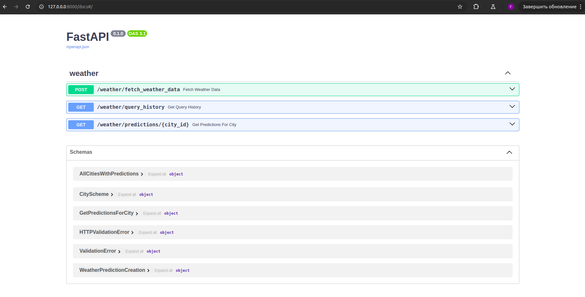
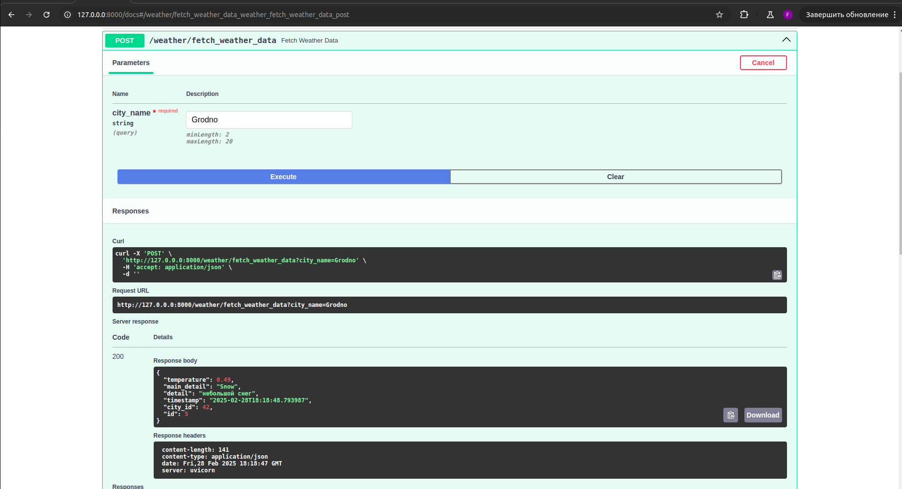
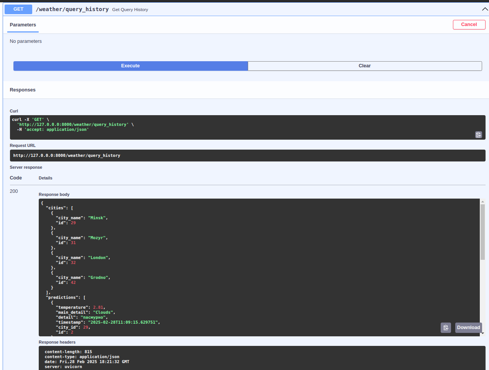
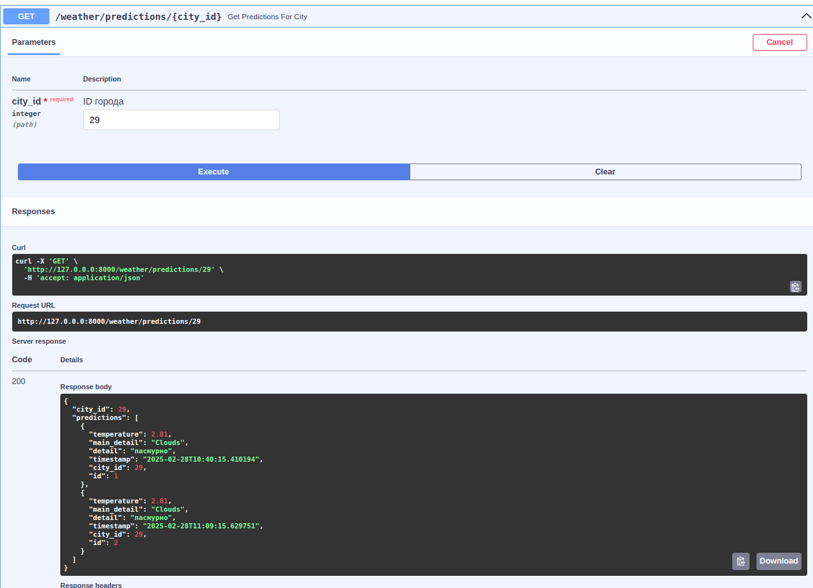

# Weather Query Web Application

## 🌍 О проекте
Веб-приложение позволяет:
- Получать актуальный прогноз погоды для любого города
- Сохранять историю запросов в базе данных
- Просматривать детали предыдущих запросов
- Использовать API через удобный Swagger-интерфейс

## 🚀 Установка и запуск

### 1. Переменные окружения
Создайте файл `.env` в корне проекта (на уровне с папкой `src`) и определите переменные:
DB_HOST
DB_PORT
DB_NAME
DB_USER
DB_PASS
OPENWEATHERMAP_KEY=ваш_api_ключ 

### 2. Миграции alembic
Сгенерируйте конфигурацию для алембика в файле src/persistence/migrations/, используя команду $ alembic init -t async,
проведите миграцию алембика, используя alembic revision --autogenerate -m "(Название миграции)", и примените эту
миграцию, используя команду alembic upgrade head.

### 3. Запуск докер-контейнеров
Перейдите в директорию докера и запустить команду docker compose up --build. Пользователь может перейти в веб-браузер
и ввести это в поле url: http://127.0.0.0:8000/docs# . 

### 4. Демонстрация функционала
Вы увидите следующие эндпоинты!

Перейдя на первый эндпоинт, и введя название города, вы сможете получить прогноз погоды на текущее время.

Перейдя на второй эндпоинт, вы сможете получить историю ваших запросов, включая все города, который вы вводили ранее и 
прогнозы погоды для них.

Перейдя на третий эндпоинт, вы сможете получить все прогнозы для определённого города, введя его id из базы данных.

Ознакомившись со всем функционалом, вы можете выключить запущенные вами контейнеры, используя команду docker compose down.